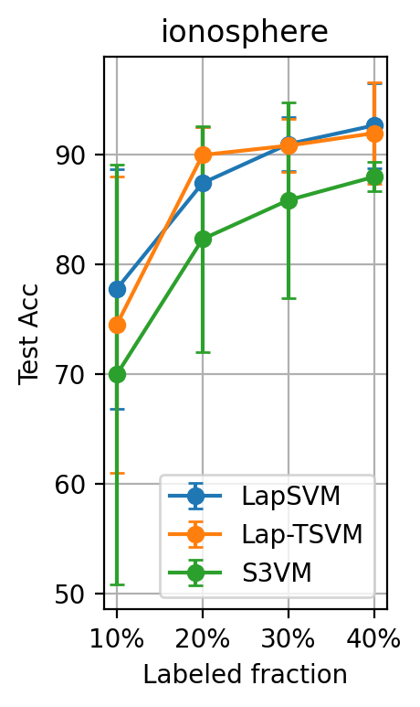
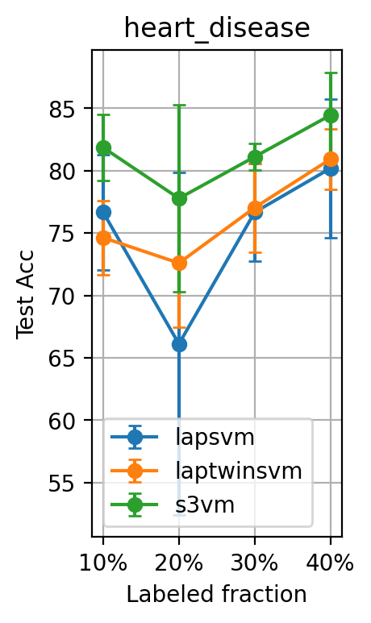
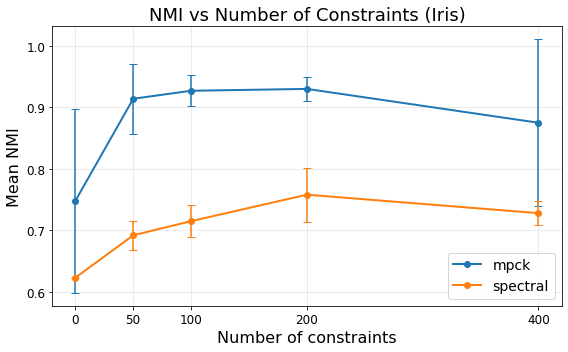
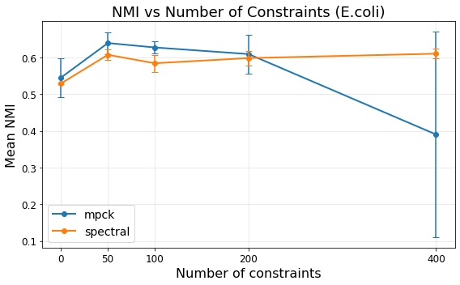

# Semi-Supervised Learning Thesis Project 


---

## 📘 Executive Summary 

The thesis explores semi-supervised learning approaches in scenarios where labeled data are limited while unlabeled data are widely available. In recent years, the growing availability of large-scale datasets has highlighted the limitations of traditional supervised learning methods, since obtaining reliable labels is often expensive, time-consuming, and impractical in many real-world applications. Semi-supervised learning addresses this issue by integrating both labeled and unlabeled data during the learning process.

The project mainly focuses on semi-supervised classification methods, investigating how unlabeled samples can support class assignment when only a small amount of labeled data is available. In addition, semi-supervised clustering techniques were analyzed to study how partial supervision can provide useful information about data organization and cluster structure.

Several algorithms were implemented and evaluated through experimental analysis on multiple UCI datasets. The results highlighted the impact of supervision, dataset structure, and constraint configuration on the effectiveness and stability of semi-supervised learning methods for both classification and clustering tasks.

---

## 🎯 Objectives

- Evaluate the effectiveness of semi-supervised learning methods under different levels of supervision
- Analyze the impact of dataset characteristics such as class separability, overlap, and dimensionality on model performance
- Investigate the role of pairwise constraints in semi-supervised clustering tasks
- Compare the behavior of different semi-supervised approaches for classification and clustering problems
- Assess the potential of semi-supervised learning in scenarios where labeled data are limited

---

## 🔬 Methods

### Semi-Supervised Classification
- Support Vector Machines (S3VM)
- Laplacian Support Vector Machines (LapSVM)
- Laplacian Twin Support Vector Machines (Lap-TSVM)

### Semi-Supervised Clustering 
- Metric Pairwise Constrained K-means (MPCK-Means)
- Semi-Supervised Spectral Clustering (Spectral SSC)

---

## ⚙️ Experimental Setup

The experimental analysis was performed on 15 UCI datasets using different semi-supervised classification and clustering configurations over multiple independent runs.

### Semi-Supervised Classification
- Experiments conducted on binary datasets and on three-class datasets transformed into binary problems using a one-vs-two strategy
- Fixed train/test split with 40% of samples used for testing
- Partial labeling applied to the training set with supervision levels of 10%, 20%, 30%, and 40%
- Hyperparameter tuning performed using Optuna with 50 optimization trials
- 20% of labeled training samples used as validation data
- Main evaluation metric: Accuracy
- Precision, Recall, and F1-score additionally analyzed in scenarios characterized by class imbalance

### Semi-Supervised Clustering
- Experiments conducted on multi-class datasets containing two or more classes
- Pairwise constraints generated from partially labeled samples
- Number of constraints evaluated: 0, 50, 100, 200, and 400
- Fixed Must-Link / Cannot-Link ratio equal to 0.6
- Partial hyperparameter tuning due to computational limitations
- Evaluation metrics: NMI, CRI, and Pairwise F1-score

---

## 🔍 Main Findings

Experimental results on classification tasks showed that increasing the amount of labeled data generally improves accuracy and stability, although performance remains strongly influenced by dataset characteristics such as class separability, overlap, and dimensionality. The analysis also highlighted that S3VM methods are often competitive with very limited supervision, while Laplacian-based approaches tend to achieve better performance as the number of labeled samples increases.

For semi-supervised clustering, the introduction of pairwise constraints generally improves clustering quality, with the largest performance gains often achieved using a relatively small number of constraints before reaching saturation effects. The experiments further showed that the stability and effectiveness of clustering methods are closely related to the intrinsic structure of the data and to the adopted constraint configuration.

### Classification Examples 

<p align="center">
  
  
</p>

- **Ionosphere:** classification accuracy generally increases as the amount of labeled data grows, highlighting the positive impact of supervision.
- **Heart Disease:** S3VM remains competitive even with very limited supervision, while Laplacian-based methods improve as more labeled samples become available.

### Clustering Examples

<p align="center">
  
  
</p>

- **Iris:** clustering quality improves rapidly with the introduction of pairwise constraints, before showing a slight decline at higher constraint levels.
- **E.coli:** clustering performance exhibits a non-monotonic trend, with MPCK-Means showing higher variability at larger numbers of constraints.
  
---

## 🛠️ Technologies Used

- Python
- Scikit-learn
- NumPy
- Optuna
- Matplotlib

---

## 📂 Repository Structure

The repository is organized into three main sections:
- `classification/` contains implementations of semi-supervised classification methods
- `clustering/` contains implementations of semi-supervised clustering algorithms
- `images/` contains selected figures used to summarize the experimental results

```text
├── classification/
│   ├── ApplicationClassification.py
│   ├── S3VM_method.py
│   ├── LapSVM_method.py
│   └── LapTwinSVM_method.py
│
├── clustering/
│   ├── ApplicationClustering.py
│   ├── MPCK_Means_method.py
│   └── SpectralSSC_method.py
│
└── images/
    ├── ecoli.png
    ├── heart_disease.png
    ├── ionosphere.png
    └── iris.png
```
---

## 🚀 Future Improvements


